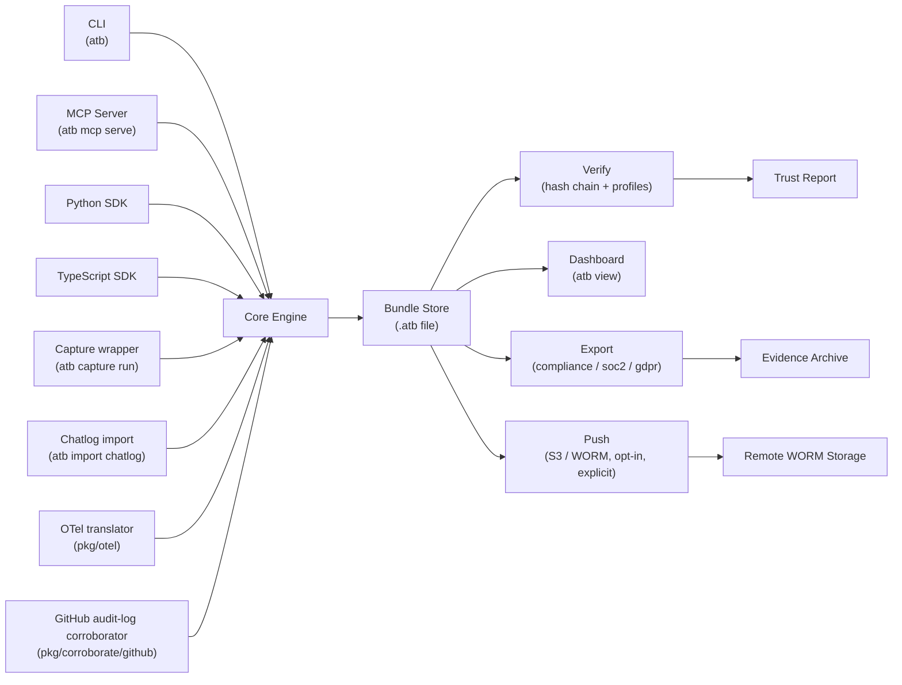

# ATB architecture

## Component overview

## Trust boundary

The trust boundary runs at the bundle file boundary. The Core Engine writes and reads the bundle; everything above the boundary (CLI commands, MCP tool calls, SDK calls) must go through the Core Engine's append and verify logic. No component reads or writes bundle records directly.

Integrity is verified at the file boundary on read: `atb verify` runs the hash chain across all records before returning results. The dashboard (`atb view`) runs the same check before serving event data — if verification fails, the data endpoints return `403`.

Export and push operations seal the bundle before writing. A bundle that fails verification cannot be exported or pushed; the operator must address the integrity issue first.

The `Push` path (`atb push s3://bucket/prefix`) is implemented. It is opt-in and explicit; bundles are not pushed automatically. See [`docs/integrations/worm-s3.md`](./integrations/worm-s3.md) for usage.

## Bundle safety semantics

Bundle mutations are serialised at the file boundary. `Save` and `SignTo`
take the bundle advisory lock before writing, serialise to a temporary file,
fsync that file, atomically rename it into place, and fsync the parent
directory. A second writer either waits when configured with `--lock-wait` or
receives lock contention without corrupting the existing bundle.

Read paths intentionally separate parsing from validation. `Load` is the
non-validating parser used by inspection tools and compatibility paths.
`LoadVerified` is the integrity-sensitive gate: it requires a manifest record,
rejects non-bundle NDJSON, and verifies the hash chain before returning bundle
data to callers that need evidence-grade reads.

Snapshot appends validate the snapshot name before any bundle I/O. Names must
be non-empty after trimming, at most 128 runes, and free of ASCII control
characters, `/`, `\`, and NUL.

The long-running CLI paths that load or append bundle state (`snapshot`,
`capture run`, `import chatlog`, and `verify`) wrap their file operations in a
default five-minute context timeout so a hung filesystem operation does not
block the command indefinitely.

## Capture and import layer

Capture v1 adds two narrow CLI entry points that sit above the Core Engine and
preserve the existing trust boundary. Both write into the bundle through the
same Core Engine append path used by `atb append` and the SDKs; neither reads
or writes bundle records directly.

`atb capture run` is a wrapper that prepares a local bundle path and runs a
child command with capture-related environment variables injected into its
process environment. It does not proxy provider traffic, intercept network
calls, or auto-instrument arbitrary runtimes. When `--snapshot <name>` is
supplied, a snapshot record is appended after the child exits. When
`--profile <id>` is supplied and the child exits successfully, the wrapper
runs `atb verify` against the resulting bundle. A non-zero child exit code
always wins: the wrapper returns the child's exit code unless the capture
layer itself hits a fatal error (lock contention surfaces as exit code 9).

`atb import chatlog` reads a saved chatlog file (or stdin) on the local
machine and writes canonical ATB events into a local `.atb` bundle. The
parser, mapper, and bounded-default fill logic live in the
`internal/capture/` package. `--from generic-jsonl` is the only supported
provider in Capture v1. Mapping
rules are documented in [`integrations/chatlog-import.md`](./integrations/chatlog-import.md):
user turns become `ai.request.received`, assistant turns with a `model`
field become `ai.model.invoked` plus `ai.model.output` plus
`ai.response.sent`, tool records become `ai.tool.exec`, and system records
contribute to prompt-window digests rather than standalone events.

Trust boundary: both entry points preserve the file boundary unchanged. The
hash chain is appended through the Core Engine, every imported record goes
through the same canonicalisation as any other event, and the resulting
bundle re-verifies under `atb verify` with no special-case import path.
Capture v1 reduces manual event entry; it does not guarantee that every
relevant event was captured, and CAS continues to score recorded evidence
within the declared profile boundary.

`pkg/otel` exposes the public Phase 9 OTel translator. It maps caller-provided
span structs to the canonical AI trace event envelope documented in
[`spec-ai-traces.md`](./spec-ai-traces.md). It is a mapping layer, not an OTLP
collector, hosted telemetry service, or automatic runtime instrumentation.

## Corroboration model

The problem corroboration addresses: ATB records only what the instrumented code explicitly
appends. A compliance reviewer's first question is "how do I know nothing was omitted?" A
local bundle cannot answer that question by itself. Corroboration adapters let ATB fetch
evidence from an external source — a queue dequeue receipt, a gateway execution log, a storage
confirmation — and record it as an `atb.corroboration.external` event in the same bundle.

What `atb.corroboration.external` records: the adapter retrieved a JSON payload from the
configured external source, computed its SHA-256 digest, and appended the digest and metadata
to the bundle. It does not verify the external system's own integrity — a compromised gateway
can produce a valid-looking corroboration record. The event records that corroboration was
attempted and what the adapter observed; nothing more.

How XC scoring works: the verifier counts the number of `atb.corroboration.external` events
that pass field validation (non-empty `source`, `reference_id`, `digest`, and a parseable
`retrieved_at` RFC 3339 timestamp). One valid corroboration event earns full XC credit
(XC = 1.0). Bundles with zero valid corroboration events return the anchor-based XC score
unchanged from v1.9.0; no existing bundle is penalised. Full XC credit means corroboration
was attempted, not that the external system's record is authoritative or complete.

Where additional adapter types would be added: `internal/corroboration/`, implementing the
`Adapter` interface. The current implementation ships one concrete type:
`HTTPGatewayAdapter`, which fetches a JSON receipt from a configured URL. Further adapters
(SQS, S3 event notifications, Kafka, manual) would be added to the same package using the
same interface — no registry or plugin system is needed at this stage.

Phase 9 also exposes `pkg/corroborate/github`, a public GitHub organisation
audit-log corroborator. It performs an explicit, caller-configured GitHub API
request using the supplied token and organisation, parses the audit-log
response, and reports the observed result plus rate-limit metadata. It does
not retry, append to bundles by itself, or prove GitHub-side completeness.
