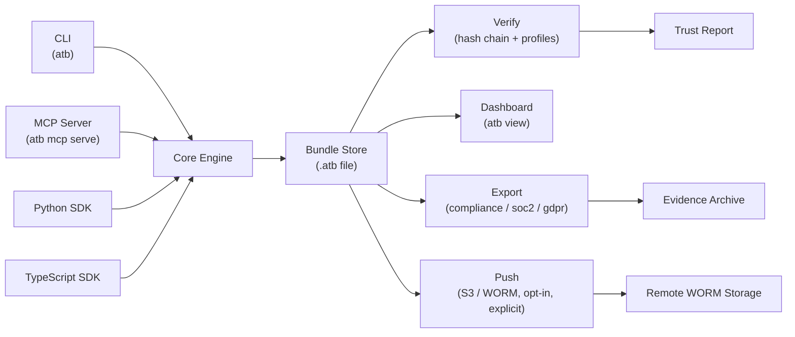

# ATB architecture

## Component overview

## Trust boundary

The trust boundary runs at the bundle file boundary. The Core Engine writes and reads the bundle; everything above the boundary (CLI commands, MCP tool calls, SDK calls) must go through the Core Engine's append and verify logic. No component reads or writes bundle records directly.

Integrity is verified at the file boundary on read: `atb verify` runs the hash chain across all records before returning results. The dashboard (`atb view`) runs the same check before serving event data — if verification fails, the data endpoints return `403`.

Export and push operations seal the bundle before writing. A bundle that fails verification cannot be exported or pushed; the operator must address the integrity issue first.

The `Push` path (`atb push s3://bucket/prefix`) is implemented. It is opt-in and explicit; bundles are not pushed automatically. See [`docs/integrations/worm-s3.md`](./integrations/worm-s3.md) for usage.
