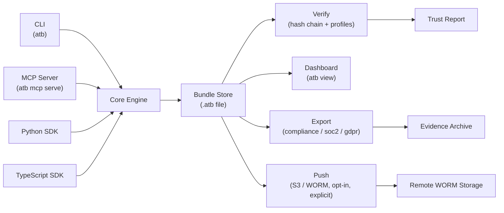

# ATB architecture

## Component overview

## Trust boundary

The trust boundary runs at the bundle file boundary. The Core Engine writes and reads the bundle; everything above the boundary (CLI commands, MCP tool calls, SDK calls) must go through the Core Engine's append and verify logic. No component reads or writes bundle records directly.

Integrity is verified at the file boundary on read: `atb verify` runs the hash chain across all records before returning results. The dashboard (`atb view`) runs the same check before serving event data — if verification fails, the data endpoints return `403`.

Export and push operations seal the bundle before writing. A bundle that fails verification cannot be exported or pushed; the operator must address the integrity issue first.

The `Push` path (`atb push s3://bucket/prefix`) is implemented. It is opt-in and explicit; bundles are not pushed automatically. See [`docs/integrations/worm-s3.md`](./integrations/worm-s3.md) for usage.

## Corroboration model

The problem corroboration addresses: ATB records only what the instrumented code explicitly
appends. A compliance reviewer's first question is "how do I know nothing was omitted?" A
local bundle cannot answer that question by itself. Corroboration adapters let ATB fetch
evidence from an external source — a queue dequeue receipt, a gateway execution log, a storage
confirmation — and record it as an `atb.corroboration.external` event in the same bundle.

What `atb.corroboration.external` records: the adapter retrieved a JSON payload from the
configured external source, computed its SHA-256 digest, and appended the digest and metadata
to the bundle. It does not verify the external system's own integrity — a compromised gateway
can produce a valid-looking corroboration record. The event records that corroboration was
attempted and what the adapter observed; nothing more.

How XC scoring works: the verifier counts the number of `atb.corroboration.external` events
that pass field validation (non-empty `source`, `reference_id`, `digest`, and a parseable
`retrieved_at` RFC 3339 timestamp). One valid corroboration event earns full XC credit
(XC = 1.0). Bundles with zero valid corroboration events return the anchor-based XC score
unchanged from v1.9.0; no existing bundle is penalised. Full XC credit means corroboration
was attempted, not that the external system's record is authoritative or complete.

Where additional adapter types would be added: `internal/corroboration/`, implementing the
`Adapter` interface. The current implementation ships one concrete type:
`HTTPGatewayAdapter`, which fetches a JSON receipt from a configured URL. Further adapters
(SQS, S3 event notifications, Kafka, manual) would be added to the same package using the
same interface — no registry or plugin system is needed at this stage.
