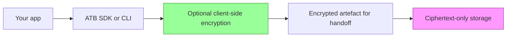

# ATB trust and security model

ATB is local-first evidence infrastructure for AI workflows. Its primary
security property is tamper evidence over recorded events, not centralised
storage, identity verification, or hosted control-plane governance.

## Core security properties

1. Integrity by default
- Event records are hash chained with SHA-256.
- Verification fails on mutation, reorder, insertion, or deletion.

2. Deterministic canonicalisation
- Event payloads are canonicalised with RFC 8785 before hashing.
- Golden tests enforce byte-identical output across the Go, Python, and TypeScript implementations.

3. Local-first data ownership
- Bundles are local files under `run.atb/` by default.
- The core workflow, `init`, `append`, `snapshot`, `verify`, and `view`, does not require network access.

4. Optional client-side encryption for handoff or storage
- `atb encrypt` and `atb decrypt` use AES-256-GCM with versioned PBKDF2-SHA256 key derivation.
- New encrypted bundles use wire version `0x02` with `600000` iterations.
- Legacy `0x01` bundles remain decryptable with `100000` iterations.

5. Standard cryptographic primitives
- Hashing, signatures, and symmetric encryption use standard libraries and established dependencies.
- For key lifecycle guidance, see [Key management](../evidence/key-management.md).

6. RFC 3161 token verification
- `atb verify --with-anchor` validates the RFC 3161 message imprint against the bundle snapshot that existed immediately before the anchor record.
- It verifies the SignerInfo signature with the TSA signing certificate.
- It verifies the TSA certificate chain against the system roots in the current environment, or against `--roots` when a PEM root pool is supplied.
- The text and JSON outputs report `anchor: verified` only when message imprint, signature, and chain verification all pass.
- If the message imprint matches but the TSA certificate chain does not verify, the anchor is reported as partial and the AC sub-score does not receive anchor credit.
- Digest mismatch, signature failure, malformed token data, or missing anchor evidence are reported as failed.
- TSA HTTP responses are capped at 4 MiB and the request has a 30-second timeout.

## Assurance layers

- Layer A, integrity: ATB bundles, SHA-256 hash chaining, RFC 8785 canonical JSON, and optional RFC 3161 TSA anchors.
- Layer B, profiles and CAS: schema-backed obligation profiles and profile-scoped completeness signals for recorded workflow evidence. CAS is a local scoring model over the events ATB can evaluate, not an external audit opinion or independent attestation.
- Layer C, ACP: control-plane gating for high-impact actions, with the invariant that no gated action should execute without an ATB precommit.
- Layer D, security scanning: full-history Gitleaks, `gosec`, pinned Bandit, both npm audits, and Trivy filesystem and Docker image scans.
- Layer E, distribution and operations: Git tags, GitHub releases, checksums, PyPI, npm, and Docker image publication.

Docker images are published by a separate `Docker Publish` workflow on tag pushes or manual dispatch. They are part of Layer E distribution rather than the Layer A-C assurance boundary.

## Limitations

Hash chaining proves intra-bundle integrity: if verification passes, the
sequence of records you are reading is internally consistent with the
declared hashes. It does not prove capture completeness, that every
material operation was logged, or that an integration emitted events for
every code path.

### Provability ladder

Integrity and evidence coverage are separate. Configure higher layers to reduce
conditional blind spots; no layer proves behaviour that never crossed the
capture boundary.

| Layer | Mechanism | Claim available when |
| --- | --- | --- |
| L1: integrity | SHA-256 chain, RFC 8785 canonical JSON, optional signature | `atb verify` reports a valid chain and, when required, a valid signature |
| L2: workflow shape | Obligation profiles, relations, temporal rules, CAS | The selected profile passes and its recorded gaps are acceptable |
| L3: source binding | Policy signatures and bundle provenance | The relevant signatures verify against independently controlled keys |
| L4: external witness | RFC 3161 anchor, WORM handoff, external corroboration | The external evidence verifies independently |
| L5: capture boundary | SDK middleware, proxy, `capture run`, imports | The integration boundary covers the operation under review |

Common residuals remain: a trusted host can replace a bundle before handoff;
caller-asserted identity needs independent IdP or PKI verification; retrospective
imports can omit tool or policy events; and profile completeness is not universal
capture completeness.

Local-first storage means trust in a bundle is bounded by trust in the
host environment. A process with filesystem access can replace or roll
back files before export unless you add independent controls.

For regulated deployments, pair ATB with filesystem integrity
monitoring, WORM-capable export, or equivalent external controls before
relying on bundles as primary evidence.

### Untrusted bundle resource limits

The Go, Python, and TypeScript readers cap each NDJSON record at 16 MiB and
default to 512 MiB and 1,000,000 non-empty records per bundle. SDK callers can
set lower positive total limits. Chatlog and OTLP/JSON imports, proxy bodies,
Mortise responses, remote-signer responses, and TSA responses also have
explicit byte limits.

These are process-safety bounds, not format changes: a larger file can still be
a valid v1 bundle, but current readers reject it before constructing an
unbounded in-memory record set. For evidence above the defaults, split capture
at a session or retention boundary and verify each bundle independently.

### Identity attribution

The `actor_id`, `org_id`, and `workspace_id` fields in bundle events are
caller-asserted attribution context and are not independently verified by
ATB. ATB proves these fields were not altered after recording, but does
not prove the values are truthful or that the recorder was authorised to
assert them. Deployments that require verified identity attribution must
supply an independent identity layer or signing scheme.

Oversight and action events may also carry an optional `identity_evidence`
object with an identity-provider name, subject, authentication context,
assertion type, and assertion digests. This is stronger evidence context than
a plain actor string because a deployment can retain the original JWT, SAML
assertion, or certificate separately and later verify it against its IdP,
JWKS, or PKI. ATB deliberately stores digests rather than bearer assertions.

ATB hash-chains the supplied identity evidence and labels it as
caller-provided. The evidence layer does not fetch JWKS, validate certificate
chains, operate an identity provider, or make a legal claim that the named
subject performed the action. Optional viewer OIDC authentication is a separate
access-control path. A reviewer should verify the original assertion
independently or attach an `atb.corroboration.external` record from the
deployment identity system.

### Retention evidence

`atb config retention`, non-dry-run `atb archive`, and successful S3 pushes
that request Object Lock append events to `.atb/operations.atb`. The separate
operations bundle prevents post-upload mutation of the evidence bundle.

`data.retention.enforced` distinguishes local archive completion from remote
API acceptance. For S3, `outcome=request_accepted` means the PUT succeeded
with Object Lock headers; `independently_verified=false` means ATB did not
inspect bucket policy or prove continuing storage-side enforcement.

## Local viewer API

The local viewer, `atb view`, binds to `127.0.0.1` by default and is
intended for single-user local inspection only. All `/api/v1/*`
endpoints require authentication.

Authentication can be performed using:
*   A per-session token generated at startup (the normal `atb view` path).
*   OIDC/JWT tokens, configured via `--oidc-issuer` and `--oidc-audience`.

OIDC is operator-configured network access. Discovery and JWKS requests have
10-second bounds, both response types are capped at 1 MiB, and redirects are
refused. JWT input is capped at 64 KiB. A key ID missing from the cached set
can trigger one immediate refresh, with further misses rate-limited for 30
seconds. The configured issuer may direct discovery to another HTTP(S) JWKS
host; ATB does not apply a destination allowlist. Treat issuer configuration as
trusted administration and do not point it at untrusted or internal-only
endpoints. HTTP support exists for local/test providers; use HTTPS for deployed
identity providers.

If neither a session token nor a JWT validator is configured, the API server
fails closed with HTTP 401. There is no unauthenticated constructor mode.
`atb view` always generates a session token.

Roles are extracted from JWT claims (or default to `viewer`) and enforced via RBAC:

- `viewer` and `auditor`: read-only review APIs.
- `operator` and `admin`: privacy reveal and other mutating review actions.

Mortise authentication is independent. ATB can read `ATB_MORTISE_TOKEN` for an
explicit handoff, but does not share viewer sessions, roles, or identity state
with Mortise.

`--host` accepts only `localhost` or a loopback IP address. ATB deliberately
does not provide a network-hosted or multi-tenant viewer mode.

## Threat model

ATB is intended to:

- Detect tampering of stored trace files.
- Maintain cross-language hash compatibility.
- Prevent accidental secret leakage through repository hygiene and CI checks.

Out of scope for the current release:

- Multi-tenant hosted trust boundaries.
- Server-side key custody.
- On-device malware compromise.

## Security controls

1. Build and release integrity
- Dependency lock files and checksum manifests are used across the Go, Python, and TypeScript release surfaces.
- CI gates run before release and publication workflows.

2. Operational controls
- GitHub Actions secrets are stored in repository secrets, and PyPI release access uses GitHub OIDC trusted publishing.
- Secrets are not committed to source control.
- The release runbook's registry checks and recovery exercise support
  maintenance readiness.

3. Incident readiness
- Follow the triage and containment procedure in [SECURITY.md](../../SECURITY.md).
- Report vulnerabilities through GitHub private vulnerability reporting.

### SOC 2-oriented control mapping (readiness baseline)

- Access control: GitHub repository permissions and branch protection.
- Change management: pull requests and CI status checks.
- Audit evidence: protected Git history, CI logs, and signed release tags.
- Encryption and integrity: SHA-256 hash-chain verification across the CLI and SDKs.

This mapping is a readiness baseline, not a formal SOC 2 attestation.

## Operational guidance

### Client-side security flow



### Data classification

ATB stores user-provided event payloads exactly as supplied.

- Public metadata: event type, sequence number, and canonical timestamp fields when present.
- Potentially sensitive data: event `data` payloads such as prompts, outputs, tool arguments, and internal context.
- Secrets should not be embedded in event payloads unless a workflow explicitly requires them.

### Security scan tooling

Run the local scan bundle with:

```bash
make security-scan
```

Behaviour:

- `make security-scan` runs Trivy, `gosec`, govulncheck, and high-severity npm audits for the web UI and TypeScript SDK.
- `make bootstrap-scanners` installs exact pinned Trivy and gosec release binaries into `.tmp/bin` after SHA-256 verification, and builds exact pinned staticcheck and govulncheck binaries from checksum-verified Go modules using isolated caches. Local gates prefer those repository-local binaries.
- For local development only, Trivy and gosec may individually fall back to their pinned Docker execution paths when no matching local binary is available.
- CI does not use Docker for the Go code scan. The security workflow installs `gosec` with `go install` and invokes the binary directly.
- CI also scans full Git history with Gitleaks, runs pinned Bandit on `sdk/python/atb`, and audits both npm lockfiles.
- CI runs Trivy filesystem and image scans on pushes, pull requests, schedules, and manual dispatches; the image scan builds a local image first.

### Privacy reveal controls

A tamper-evidence tool must not change the evidence when an operator
inspects it. Revealing a masked field therefore never writes to the
authoritative bundle. Each reveal is recorded in a separate sidecar,
`<bundle>.reveals`, which is itself a genesis-rooted ATB hash chain.
Each reveal entry records `source_bundle_id` and `source_head_hash`, so
the sidecar proves which bundle and which chain head it annotates without
mutating that bundle. The sidecar verifies independently with
`atb verify`.

The `/api/v1/privacy/reveal` endpoint is rate-limited to reduce
enumeration risk.

Current defaults:

- 10 requests per minute per token.
- Reveal auditing is written to a separate sidecar, never to the loaded bundle. Viewing a field does not change the authoritative bundle on disk.
- PII masking rules loaded from `ATB_PII_FIELDS_PATH` when set, otherwise the bundled default rules shipped with ATB.

#### Testing

```bash
TOKEN="<local-viewer-token>"
for i in {1..12}; do
  curl -s -o /dev/null -w "$i:%{http_code} " \
    -X POST http://localhost:8080/api/v1/privacy/reveal \
    -H "X-ATB-Viewer-Token: $TOKEN" \
    -d '{"seq":1}'
done
```

The eleventh request should return `429`.

#### Monitoring

Rate-limit hits return `429` with `Retry-After` and are not recorded in
the audit chain. Successful privacy reveals are recorded in the reveal
sidecar (`<bundle>.reveals`), a separate hash chain. The authoritative
bundle is never modified by a reveal. The sidecar is itself a valid ATB
bundle and verifies independently with `atb verify`.
