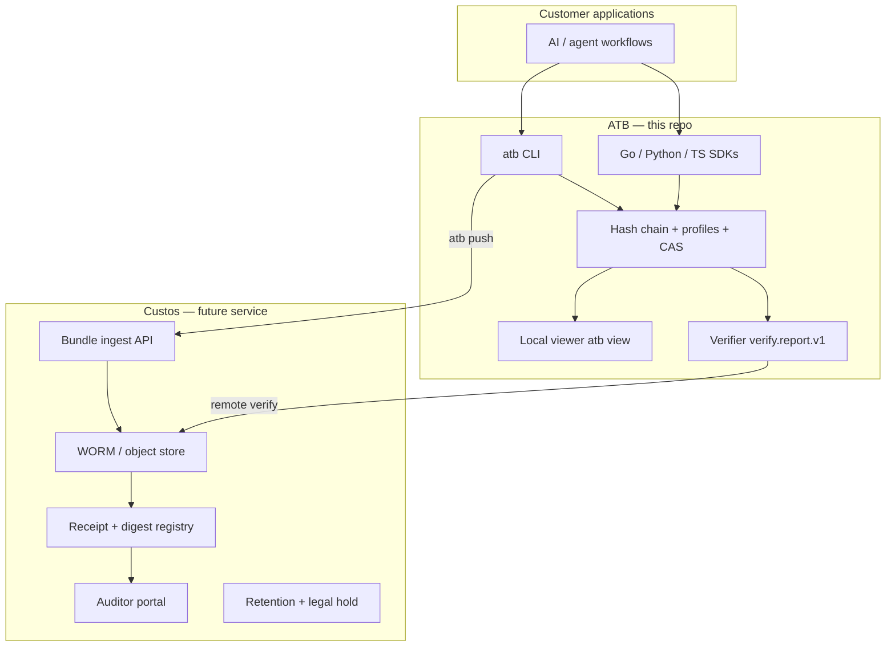

# Custos development handoff

This document is the engineering handoff from **ATB** (local integrity substrate) to **Custos** (hosted custodian-of-record service). It states what is stable today, what Custos must add, and the recommended build order.

**Status update:** the custody product now exists as its own repository —
[`custos-product`](https://github.com/pcguest/custos-product) (v0.4.0:
verify-on-ingest, S3 Object Lock WORM, Ed25519 receipts, multi-tenant keys,
RFC 3161 timestamps, and an RFC 6962 transparency log with witness
cosignatures, a public checkpoint feed, and a fork monitor). Point ingest
integrations at its `custos-ingestd`, not at the in-repo scaffold. The
end-to-end flow is documented in `custos-product/docs/e2e-atb-custos.md`.
Note for `atb intercept --custos <endpoint>`: the auto-push sends **no
Authorization header**, so it suits no-auth dev daemons or a reverse proxy
that injects the Bearer key; token-guarded `custos-ingestd` deployments
should ingest via `curl`/presigned uploads instead.

The authoritative statement of what the combined system does and does not do
— capture/integrity/custody/product boundaries plus the canonical
never-claims list — is `custos-product/docs/capability-boundary.md` (the
"four rings"), backed by the schema liveness audit in
`custos-product/docs/schema-coverage.md`.

The in-repo reference layer under `custos/` (a separate Go module covering ingestion, receipt store, signing policy, and auth) remains a prototype of the ingest and custody boundary; it is not the product. Everything below is grounded in shipped ATB behaviour, tests, and docs, and predates the product repo — read it as the original handoff brief.

---

## Layer model



| Layer | Owns | Does not own |
|-------|------|--------------|
| **ATB** | Local `.atb` format, hash chain, six obligation profiles, CAS, verifier JSON, optional S3 push, local viewer | Multi-tenant auth, long-term retention policy, receipt registry, SLA, billing |
| **Custos** | Durable storage, content-addressed receipts, auditor access, retention/legal hold, corroboration orchestration at scale | Redefining bundle hashes, profile semantics, or verifier scoring without versioned ATB releases |

**Rule:** Custos treats ATB bundles as opaque evidence artefacts. Integrity and profile meaning come from the ATB verifier; Custos adds **custody** (who submitted what, when, under which policy, and where it lives immutably).

---

## Stable contracts (do not fork)

Custos should depend on these without reimplementation:

| Contract | Location | Use in Custos |
|----------|----------|---------------|
| Bundle format (NDJSON, RFC 8785 + SHA-256) | `docs/spec-v1.0.md`, golden tests | Ingest validation before accept |
| `atb verify --format json` | `docs/api/verify-schema.md`, `internal/verify/report.go` | Post-ingest and on-demand audit |
| Profile IDs (`atb.profile.*`) | `docs/profiles.md`, `internal/profiles/templates/` | Workflow classification at receipt time |
| CAS sub-scores | `docs/cas-guide.md` | Completeness signalling in auditor UI |
| Content-addressed S3 keys | `docs/spec/bundle-push.md` | `sha256-<head-hash>.atb` as receipt ID |
| Remote verify | `atb verify --remote s3://…` | Stream-verify without full download to client |
| Queue envelope (optional) | `docs/integrations/push-transports.md` | Async ingest notification |

Cross-language hash parity is locked by Go / Python / TypeScript golden tests. Custos ingest should call the **Go verifier** (library or CLI), not re-score CAS.

---

## Wire format

ATB exports one local bundle handoff object for custody ingest. The object is a
JSON document; the `bundle` field is the original verified `.atb` bytes encoded
as base64 by standard JSON encoding for byte slices. Custos must store the
bundle bytes as an opaque artefact and use the embedded verifier report as a
snapshot of ATB's local interpretation at export time.

```json
{
  "export_version": "atb.custody.bundle_export.v1",
  "receipt_id": "sha256-<head-hash>",
  "bundle_hash": "<head-hash>",
  "submitted_at": "2026-05-28T00:00:00Z",
  "profile_id": "atb.profile.rag_answer",
  "submitter_ref": "customer-local-ref",
  "verify_report": {
    "report_version": "verify.report.v1"
  },
  "bundle": "<base64 .atb bytes>"
}
```

Required fields: `export_version`, `receipt_id`, `bundle_hash`,
`submitted_at`, `verify_report`, and `bundle`.

Optional fields: `profile_id` and `submitter_ref`.

`bundle_hash` is the ATB bundle head hash, i.e. the hash on the final NDJSON
record after `LoadVerified` succeeds. `receipt_id` is the content-addressed key
`sha256-<bundle_hash>`. This wire object does not prove that capture was
complete, that the submitter identity is legally verified, or that a hosted
custodian has accepted the artefact; those are Custos responsibilities.

---

## What ATB provides today (substrate checklist)

- [x] Tamper-evident local bundles
- [x] Six built-in obligation profiles with blind-spot declarations
- [x] CAS + structured verifier output (`verify.report.v1`)
- [x] Profile workflow SDK helpers (RAG middleware, action gate, data export, policy decision, human override, background jobs)
- [x] Passing/failing fixture corpus (`examples/bundles/profiles/`, 12 files)
- [x] S3/WORM push (client-side; bucket policy is operator responsibility)
- [x] Local viewer with profile/CAS summary (`atb view`)
- [x] Viewer API: `GET /api/v1/bundle/verify/report` for full verifier JSON
- [x] Custos ingest conformance test (`test/custos/conformance_test.go`)
- [x] `atb verify --schema` prints frozen JSON Schema (`verify.report.v1.schema.1`)

---

## What Custos must build

### Phase 1 — Receipt MVP (4–6 weeks)

Goal: *“Submit a bundle, get a receipt, anyone can re-verify the same bytes.”*

1. **Ingest API** — accept `.atb` upload or presigned PUT; compute head hash; reject if chain invalid.
2. **WORM storage** — S3 Object Lock (COMPLIANCE) or equivalent; key = `sha256-<head-hash>.atb`.
3. **Receipt object** — immutable record: `{ receipt_id, bundle_hash, submitted_at, profile_id, verify_report, submitter_ref }`.
4. **Verify-on-ingest** — run `EvaluateBundle` + profile; store `verify.report.v1` snapshot with receipt.
5. **Public verify endpoint** — given `receipt_id` or hash, return stored verifier report + integrity status (read-only).

Reuse: `internal/verify`, `internal/push`, existing `atb verify --remote` semantics.

### Phase 2 — Auditor portal (4–6 weeks)

Goal: *“Auditor can review without CLI access.”*

1. Authenticated read API over receipts (not raw bundle mutation).
2. UI: integrity, profile pass/fail, CAS, sub-scores, critical failures, **blind spots / exclusions**, event timeline (masked fields policy).
3. Export pack: bundle + verifier JSON + receipt metadata (zip sidecar pattern exists in `atb export --with-verify`).

Reuse: viewer components (`web/components/dashboard/ProfileCAS.tsx`) as UX reference; `VerifierReport` shape.

### Phase 3 — Operations (ongoing)

- Retention schedules and legal hold (Custos policy engine; ATB only documents retention patterns in `docs/compliance/retention.md`).
- Corroboration adapter registry (ATB emits `atb.corroboration.external`; Custos schedules/triggers adapters).
- SIEM/GRC forwarders (see `docs/integrations/siem-grc.md`).
- Multi-tenant auth, billing, SLA — explicitly out of ATB scope.

---

## Running `custosd` (current daemon)

A scaffold `custosd` now exists in this repo (`custos/cmd/custosd`). It is an
early ingest/receipt daemon, not the hosted multi-tenant service. Its trust
boundary is deliberately conservative; understand these defaults before
exposing it beyond a developer machine.

### Bind and authentication

- **Loopback by default.** `--host` defaults to `127.0.0.1` and `--port` to
  `9090`. A fresh daemon is not reachable off the host.
- **Auth token.** Set `CUSTOS_AUTH_TOKEN` to require a bearer token on every
  route except `GET /health`. Empty token keeps local-dev ergonomics.
- **Fail-closed bind guard.** The daemon **refuses to start** if `--host` is a
  non-loopback interface (e.g. `0.0.0.0`, a LAN address, or empty) while
  `CUSTOS_AUTH_TOKEN` is unset. There is no unauthenticated network exposure by
  accident; you must opt in by setting a token. Loopback + empty token remains
  allowed for local development only.

### Ingest limits

- **`--max-ingest-bytes`** (default 32 MiB) bounds the `POST /ingest` body via
  `http.MaxBytesReader` at the HTTP boundary. Oversize uploads return **HTTP
  413** before the body is buffered into memory or verified, so a large or
  malicious upload cannot exhaust memory ahead of validation.
- Status codes: `413` oversize, `400` empty body, `422` invalid/unverifiable
  bundle, `405` non-`POST`, `201` accepted (returns the receipt JSON).

### Transport

- The daemon speaks **bare HTTP** (`#nosec G114`). This is intentional for the
  loopback-by-default posture: terminate TLS at an operator-controlled reverse
  proxy (or equivalent) when exposing the service, and pair it with
  `CUSTOS_AUTH_TOKEN`. Do not expose bare HTTP to an untrusted network.

### Storage

- `--worm-dir` / `--receipt-dir` (default under `~/.atb/custos/`) select the
  filesystem WORM and receipt stores. Setting **both** flags empty selects the
  in-memory stores (test harnesses only); a half-configured pair is rejected at
  startup. The WORM `Retrieve` path rejects receipt IDs that would escape the
  configured root (path-traversal regression-tested).

### Production hardening checklist

The scaffold daemon is safe by default for local use, but it is a **transport
guard, not an identity system**. Before exposing it to anything beyond a single
operator's machine, confirm the boundary below. The bearer token is a shared
secret that authenticates the *connection*, not a *tenant* or a *user*.

What the daemon covers today:

- Loopback-default bind with a fail-closed guard against unauthenticated network
  exposure (see *Bind and authentication*).
- Constant-time bearer-token comparison (`crypto/subtle`) on every route except
  `GET /health`.
- Bounded ingest body with verify-before-persist ordering: only bundles that
  pass hash-chain verification reach the WORM store.

What it does **not** cover (operator responsibilities before production):

- [ ] **TLS.** Terminate TLS at an operator-controlled reverse proxy; never
      expose bare HTTP to an untrusted network.
- [ ] **Token rotation.** `CUSTOS_AUTH_TOKEN` is a single static secret; there is
      no built-in rotation, revocation, or expiry. Procedure: issue the new token
      at the reverse proxy, restart `custosd` with the new `CUSTOS_AUTH_TOKEN`,
      then retire the old one. The daemon holds **one** token at a time (no
      dual-token overlap window), so clients see brief `401`s until they present
      the new token — schedule rotation for a maintenance moment, or front the
      daemon with a proxy that injects the bearer token so rotation is invisible
      to clients.
- [ ] **Per-tenant / per-user identity.** There is no mTLS, OIDC, or tenant
      scoping. Every holder of the token has identical access to ingest and to
      every receipt and bundle. Add an authenticating proxy if you need
      multi-tenant isolation.
- [ ] **Rate limiting / abuse controls.** None are built in; rely on the proxy.
- [ ] **Verification scope.** `GET /receipts/{id}/verify` re-runs **hash-chain**
      verification only (empty profile); it does **not** re-check
      profile-completeness. Treat a green re-verify as "bytes are intact and the
      chain is sound", not "the bundle satisfies an obligation profile".

---

## Demo script (Custos pitch using ATB only)

Run locally before Custos exists; shows the custody **gap** ATB leaves open.

```bash
# Build with embedded viewer
cd web && npm ci && npm run build && cd .. && go build -o atb ./cmd/atb

# 1. Happy path — privileged tool action
atb verify --bundle examples/bundles/profiles/privileged_tool_action-pass.atb \
  --profile atb.profile.privileged_tool_action --format json | jq '{pass, cas_grade, sub_scores}'

# 2. Failure mode — missing precommit
atb verify --bundle examples/bundles/profiles/privileged_tool_action-fail.atb \
  --profile atb.profile.privileged_tool_action --format json | jq '.critical_failures'

# 3. Local auditor view
atb view --bundle examples/bundles/profiles/data_export-pass.atb \
  --profile atb.profile.data_export --no-open
# Open http://127.0.0.1:8080/view/#session=<token from stderr>

# 4. Push to WORM (optional; needs bucket + credentials)
# atb push s3://your-bucket/custos-demo/ --bundle examples/bundles/profiles/policy_decision-pass.atb --lock-until 2027-01-01
# atb verify --remote s3://your-bucket/custos-demo/sha256-<hash>.atb --profile atb.profile.policy_decision
```

**Talking points:**

- ATB proves *what was recorded* has not changed.
- CAS shows *how complete* the recording is for a declared workflow.
- Profile **blind spots** state what is explicitly *not* proven (shown in verifier `exclusions`).
- Custos closes the loop: *who custody-held this artefact, when, and where an independent auditor can retrieve it*.

---

## Recommended next step for ATB (before Custos Phase 1)

**Single priority:** treat the verifier report as a frozen custody interface and publish a **Custos ingest conformance test** in this repo.

Concrete tasks (1–2 days):

1. ~~Add `test/custos/conformance_test.go`~~ — done; locks custody contract on pass fixtures.
2. Document ingest pseudocode in this file (done above) and link from `docs/roadmap.md`.
3. Optional: `atb verify --format json --schema` flag printing JSON Schema for `VerifierReport` (machine-readable contract for Custos codegen). **Shipped** as `atb verify --schema`.

Do **not** expand ATB into multi-tenant storage, auth, or billing — that belongs in Custos.

---

## Custos repository suggestions

When Custos is split to its own repo:

```
custos/
  cmd/custosd/          # ingest + verify API
  internal/ingest/      # wraps github.com/pcguest/atb/internal/verify
  internal/receipt/     # receipt model + immutability
  internal/store/       # S3 WORM adapter (may reuse internal/push patterns)
  web/                  # auditor portal (fork/evolve ATB viewer)
  test/fixtures/        # submodule or copy of examples/bundles/profiles/
```

Pin ATB module version; run ATB integration tests in Custos CI on every bump.

---

## References

- [Architecture](./architecture.md)
- [Profiles & blind spots](./profiles.md)
- [CAS guide](./cas-guide.md)
- [Verify JSON schema](./api/verify-schema.md)
- [Bundle push / WORM](./spec/bundle-push.md)
- [Security model](./security.md)
