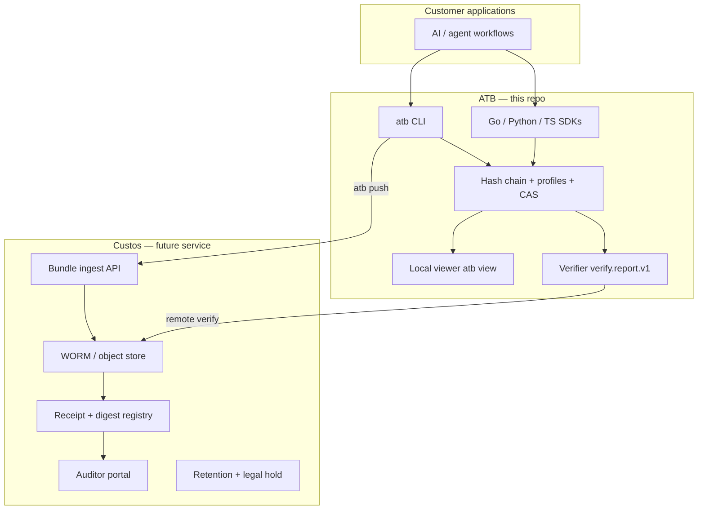

# Custos development handoff

This document is the engineering handoff from **ATB** (local integrity substrate) to **Custos** (hosted custodian-of-record service). It states what is stable today, what Custos must add, and the recommended build order.

Custos is not implemented in this repository. Everything below is grounded in shipped ATB behaviour, tests, and docs.

---

## Layer model



| Layer | Owns | Does not own |
|-------|------|--------------|
| **ATB** | Local `.atb` format, hash chain, six obligation profiles, CAS, verifier JSON, optional S3 push, local viewer | Multi-tenant auth, long-term retention policy, receipt registry, SLA, billing |
| **Custos** | Durable storage, content-addressed receipts, auditor access, retention/legal hold, corroboration orchestration at scale | Redefining bundle hashes, profile semantics, or verifier scoring without versioned ATB releases |

**Rule:** Custos treats ATB bundles as opaque evidence artefacts. Integrity and profile meaning come from the ATB verifier; Custos adds **custody** (who submitted what, when, under which policy, and where it lives immutably).

---

## Stable contracts (do not fork)

Custos should depend on these without reimplementation:

| Contract | Location | Use in Custos |
|----------|----------|---------------|
| Bundle format (NDJSON, RFC 8785 + SHA-256) | `docs/spec-v1.0.md`, golden tests | Ingest validation before accept |
| `atb verify --format json` | `docs/api/verify-schema.md`, `internal/verify/report.go` | Post-ingest and on-demand audit |
| Profile IDs (`atb.profile.*`) | `docs/profiles.md`, `internal/profiles/templates/` | Workflow classification at receipt time |
| CAS sub-scores | `docs/cas-guide.md` | Completeness signalling in auditor UI |
| Content-addressed S3 keys | `docs/spec/bundle-push.md` | `sha256-<head-hash>.atb` as receipt ID |
| Remote verify | `atb verify --remote s3://…` | Stream-verify without full download to client |
| Queue envelope (optional) | `docs/integrations/push-transports.md` | Async ingest notification |

Cross-language hash parity is locked by Go / Python / TypeScript golden tests. Custos ingest should call the **Go verifier** (library or CLI), not re-score CAS.

---

## What ATB provides today (substrate checklist)

- [x] Tamper-evident local bundles
- [x] Six built-in obligation profiles with blind-spot declarations
- [x] CAS + structured verifier output (`verify.report.v1`)
- [x] Profile workflow SDK helpers (RAG middleware, action gate, data export, policy decision, human override, background jobs)
- [x] Passing/failing fixture corpus (`examples/bundles/profiles/`, 12 files)
- [x] S3/WORM push (client-side; bucket policy is operator responsibility)
- [x] Local viewer with profile/CAS summary (`atb view`)
- [x] Viewer API: `GET /api/v1/bundle/verify/report` for full verifier JSON
- [x] Custos ingest conformance test (`test/custos/conformance_test.go`)
- [x] `atb verify --schema` prints frozen JSON Schema (`verify.report.v1.schema.1`)

---

## What Custos must build

### Phase 1 — Receipt MVP (4–6 weeks)

Goal: *“Submit a bundle, get a receipt, anyone can re-verify the same bytes.”*

1. **Ingest API** — accept `.atb` upload or presigned PUT; compute head hash; reject if chain invalid.
2. **WORM storage** — S3 Object Lock (COMPLIANCE) or equivalent; key = `sha256-<head-hash>.atb`.
3. **Receipt object** — immutable record: `{ receipt_id, bundle_hash, submitted_at, profile_id, verify_report, submitter_ref }`.
4. **Verify-on-ingest** — run `EvaluateBundle` + profile; store `verify.report.v1` snapshot with receipt.
5. **Public verify endpoint** — given `receipt_id` or hash, return stored verifier report + integrity status (read-only).

Reuse: `internal/verify`, `internal/push`, existing `atb verify --remote` semantics.

### Phase 2 — Auditor portal (4–6 weeks)

Goal: *“Auditor can review without CLI access.”*

1. Authenticated read API over receipts (not raw bundle mutation).
2. UI: integrity, profile pass/fail, CAS, sub-scores, critical failures, **blind spots / exclusions**, event timeline (masked fields policy).
3. Export pack: bundle + verifier JSON + receipt metadata (zip sidecar pattern exists in `atb export --with-verify`).

Reuse: viewer components (`web/components/dashboard/ProfileCAS.tsx`) as UX reference; `VerifierReport` shape.

### Phase 3 — Operations (ongoing)

- Retention schedules and legal hold (Custos policy engine; ATB only documents retention patterns in `docs/compliance/retention.md`).
- Corroboration adapter registry (ATB emits `atb.corroboration.external`; Custos schedules/triggers adapters).
- SIEM/GRC forwarders (see `docs/integrations/siem-grc.md`).
- Multi-tenant auth, billing, SLA — explicitly out of ATB scope.

---

## Demo script (Custos pitch using ATB only)

Run locally before Custos exists; shows the custody **gap** ATB leaves open.

```bash
# Build with embedded viewer
cd web && npm ci && npm run build && cd .. && go build -o atb ./cmd/atb

# 1. Happy path — privileged tool action
atb verify --bundle examples/bundles/profiles/privileged_tool_action-pass.atb \
  --profile atb.profile.privileged_tool_action --format json | jq '{pass, cas_grade, sub_scores}'

# 2. Failure mode — missing precommit
atb verify --bundle examples/bundles/profiles/privileged_tool_action-fail.atb \
  --profile atb.profile.privileged_tool_action --format json | jq '.critical_failures'

# 3. Local auditor view
atb view --bundle examples/bundles/profiles/data_export-pass.atb \
  --profile atb.profile.data_export --no-open
# Open http://127.0.0.1:8080/view/#session=<token from stderr>

# 4. Push to WORM (optional; needs bucket + credentials)
# atb push s3://your-bucket/custos-demo/ --bundle examples/bundles/profiles/policy_decision-pass.atb --lock-until 2027-01-01
# atb verify --remote s3://your-bucket/custos-demo/sha256-<hash>.atb --profile atb.profile.policy_decision
```

**Talking points:**

- ATB proves *what was recorded* has not changed.
- CAS shows *how complete* the recording is for a declared workflow.
- Profile **blind spots** state what is explicitly *not* proven (shown in verifier `exclusions`).
- Custos closes the loop: *who custody-held this artefact, when, and where an independent auditor can retrieve it*.

---

## Recommended next step for ATB (before Custos Phase 1)

**Single priority:** treat the verifier report as a frozen custody interface and publish a **Custos ingest conformance test** in this repo.

Concrete tasks (1–2 days):

1. ~~Add `test/custos/conformance_test.go`~~ — done; locks custody contract on pass fixtures.
2. Document ingest pseudocode in this file (done above) and link from `docs/roadmap.md`.
3. Optional: `atb verify --format json --schema` flag printing JSON Schema for `VerifierReport` (machine-readable contract for Custos codegen). **Shipped** as `atb verify --schema`.

Do **not** expand ATB into multi-tenant storage, auth, or billing — that belongs in Custos.

---

## Custos repository suggestions

When Custos is split to its own repo:

```
custos/
  cmd/custosd/          # ingest + verify API
  internal/ingest/      # wraps github.com/pcguest/atb/internal/verify
  internal/receipt/     # receipt model + immutability
  internal/store/       # S3 WORM adapter (may reuse internal/push patterns)
  web/                  # auditor portal (fork/evolve ATB viewer)
  test/fixtures/        # submodule or copy of examples/bundles/profiles/
```

Pin ATB module version; run ATB integration tests in Custos CI on every bump.

---

## References

- [Architecture](./architecture.md)
- [Profiles & blind spots](./profiles.md)
- [CAS guide](./cas-guide.md)
- [Verify JSON schema](./api/verify-schema.md)
- [Bundle push / WORM](./spec/bundle-push.md)
- [Security model](./security.md)
