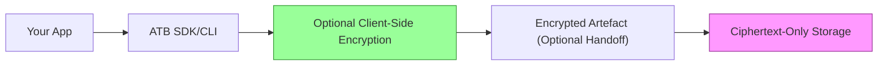

# ATB Security Model

ATB is designed for tamper evidence first and local-first operation.

## Core Security Properties

1. Integrity by default
- Event records are hash chained with SHA-256.
- Verification fails on mutation, reorder, insertion, or deletion.

2. Deterministic canonicalization
- Event payloads are canonicalized using RFC 8785 (JCS) before hashing.
- Golden tests enforce byte-identical output across Go, Python, and TypeScript implementations.

3. Local-first data ownership
- Bundles are local files (`run.atb/*.atb`) by default.
- Core workflow (`init`, `append`, `snapshot`, `verify`, `view`) does not require network access.

4. Optional client-side encryption for handoff/storage
- `atb encrypt`/`atb decrypt` use AES-256-GCM with PBKDF2-SHA256 key derivation (`100000` iterations).
- Local `.atb` bundles are hash-chained for integrity; encryption is opt-in and applied when you explicitly encrypt payloads.
- Any future handoff flow must keep encryption client-side and must not change the local-first default.

5. Zero custom cryptography
- Hashing and cryptographic primitives rely on standard language libraries and audited dependencies.

6. RFC 3161 token verification
- `atb verify --with-anchor` verifies the full RFC 3161 token: digest match, TSA certificate chain against system roots, and SignerInfo signature.

## Assurance Layers

- Layer A, Integrity: ATB bundles, SHA-256 hash chaining, RFC 8785 canonical JSON, and optional RFC 3161 TSA anchors.
- Layer B, Profiles and CAS: schema-backed obligation profiles and profile-scoped completeness scoring for workflow evidence.
- Layer C, ACP: control-plane gating for high-impact actions, with the invariant that no gated action should execute without an ATB pre-commit.
- Layer D, Security scanning: `gosec`, Bandit, and `npm audit` on the repository, plus scheduled or manually requested Trivy filesystem and Docker image scans.
- Layer E, Distribution and ops: Git tags, GitHub releases, checksums, PyPI, npm, and Docker image publication.

Docker images are published by a separate `Docker Publish` workflow on tag pushes or manual dispatch. They remain part of Layer E distribution rather than the Layer A-C assurance boundary.

## Client-Side Security Flow



## Data Classification

ATB stores user-provided event payloads exactly as supplied.

- Public metadata: event type, sequence number, timestamp fields when present.
- Potentially sensitive: event `data` payloads (prompts, outputs, tool arguments, internal context).
- Secrets should not be embedded in event payloads unless explicitly required by your workflow.

## Threat Model (v1)

- Detect tampering of stored trace files.
- Maintain cross-language hash compatibility.
- Prevent accidental secret leakage through repository hygiene and CI checks.

Out of scope for v1:

- Multi-tenant hosted trust boundaries
- Server-side key custody
- On-device malware compromise

## Security Controls

1. Build and release integrity
- Dependency lock files/checksum manifests in Go, Python, and TypeScript packages.
- CI gating before release workflows.

2. Operational controls
- Secrets in GitHub Actions are stored in repository secrets, and PyPI release access uses GitHub OIDC trusted publishing.
- No secrets committed to source control.
- Weekly registry health checks and maintenance checklist in `docs/maintenance/`.

3. Incident readiness
- Follow [docs/incident-response.md](./incident-response.md) for triage and containment.
- Report vulnerabilities through [../SECURITY.md](../SECURITY.md).

## SOC2-Oriented Control Mapping (Lightweight)

- Access control: GitHub repository permissions + branch protection.
- Change management: pull requests + CI status checks.
- Audit evidence: immutable git history, CI logs, release tags.
- Encryption/integrity: SHA-256 hash chain verification in all SDKs.

This mapping is a readiness baseline, not a formal SOC2 attestation.

## Security Scan Tooling

Run security scanners with:

```bash
make security-scan
```

Behavior:

- `make security-scan` runs the local Trivy filesystem scan and the Go `gosec` repository scan.
- For local development only, it may fall back to Docker-based execution for those two tools when local binaries are missing.
- CI does not use Docker for the Go code scan. The security workflow installs `gosec` with `go install` and invokes the binary directly.
- CI also runs Bandit on `sdk/python/atb` and `npm audit` in `sdk/typescript`.
- CI runs Trivy filesystem scans via the GitHub Action on scheduled or manually dispatched security sweeps with `scan-type: fs`.
- CI runs Trivy image scans only on scheduled or manually dispatched runs, building a local Docker image first and then scanning it with `scan-type: image`.

This keeps local validation usable on workstations without preinstalled scanners while the CI gates stay on pinned action or binary-based execution paths.

## Privacy Reveal Controls

The `/api/v1/privacy/reveal` endpoint is rate-limited to prevent enumeration attacks.

Current default:

- 10 requests per minute per token
- reveal auditing appended into `bundle.atb`
- PII masking rules loaded from `ATB_PII_FIELDS_PATH` when set, otherwise the bundled default rules shipped with ATB

### Testing

```bash
# Should return 429 on 11th request
TOKEN="your-token"
for i in {1..12}; do
  curl -s -o /dev/null -w "$i:%{http_code} " \
    -X POST http://localhost:8080/api/v1/privacy/reveal \
    -H "X-ATB-Viewer-Token: $TOKEN" \
    -d '{"seq":1}'
done
```

### Monitoring

Rate limit hits return `429` with `Retry-After` and are not appended to the audit chain. Successful privacy reveals are appended to `bundle.atb`.
