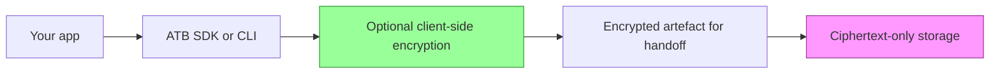

# ATB security model

ATB is local-first evidence infrastructure for AI workflows. Its primary
security property is tamper evidence over recorded events, not centralised
storage, identity verification, or hosted control-plane governance.

## Core security properties

1. Integrity by default
- Event records are hash chained with SHA-256.
- Verification fails on mutation, reorder, insertion, or deletion.

2. Deterministic canonicalisation
- Event payloads are canonicalised with RFC 8785 before hashing.
- Golden tests enforce byte-identical output across the Go, Python, and TypeScript implementations.

3. Local-first data ownership
- Bundles are local files under `run.atb/` by default.
- The core workflow, `init`, `append`, `snapshot`, `verify`, and `view`, does not require network access.

4. Optional client-side encryption for handoff or storage
- `atb encrypt` and `atb decrypt` use AES-256-GCM with versioned PBKDF2-SHA256 key derivation.
- New encrypted bundles use wire version `0x02` with `600000` iterations.
- Legacy `0x01` bundles remain decryptable with `100000` iterations.

5. Standard cryptographic primitives
- Hashing, signatures, and symmetric encryption use standard libraries and established dependencies.
- For key lifecycle guidance, see [Key management](./key-management.md).

6. RFC 3161 token verification
- `atb verify --with-anchor` validates the RFC 3161 message imprint against the bundle snapshot that existed immediately before the anchor record.
- It verifies the SignerInfo signature with the TSA signing certificate.
- It verifies the TSA certificate chain against the system roots in the current environment, or against `--roots` when a PEM root pool is supplied.
- The text and JSON outputs report `anchor: verified` only when message imprint, signature, and chain verification all pass.
- If the message imprint matches but the TSA certificate chain does not verify, the anchor is reported as partial and the AC sub-score does not receive anchor credit.
- Digest mismatch, signature failure, malformed token data, or missing anchor evidence are reported as failed.

## Assurance layers

- Layer A, integrity: ATB bundles, SHA-256 hash chaining, RFC 8785 canonical JSON, and optional RFC 3161 TSA anchors.
- Layer B, profiles and CAS: schema-backed obligation profiles and profile-scoped completeness signals for recorded workflow evidence. CAS is a local scoring model over the events ATB can evaluate, not an external audit opinion or independent attestation.
- Layer C, ACP: control-plane gating for high-impact actions, with the invariant that no gated action should execute without an ATB precommit.
- Layer D, security scanning: `gosec`, Bandit, and `npm audit` on the repository, plus scheduled or manually requested Trivy filesystem and Docker image scans.
- Layer E, distribution and operations: Git tags, GitHub releases, checksums, PyPI, npm, and Docker image publication.

Docker images are published by a separate `Docker Publish` workflow on tag pushes or manual dispatch. They are part of Layer E distribution rather than the Layer A-C assurance boundary.

## Limitations

Hash chaining proves intra-bundle integrity: if verification passes, the
sequence of records you are reading is internally consistent with the
declared hashes. It does not prove capture completeness, that every
material operation was logged, or that an integration emitted events for
every code path.

Local-first storage means trust in a bundle is bounded by trust in the
host environment. A process with filesystem access can replace or roll
back files before export unless you add independent controls.

For regulated deployments, pair ATB with filesystem integrity
monitoring, WORM-capable export, or equivalent external controls before
relying on bundles as primary evidence.

### Identity attribution

The `actor_id`, `org_id`, and `workspace_id` fields in bundle events are
caller-asserted attribution context and are not independently verified by
ATB. ATB proves these fields were not altered after recording, but does
not prove the values are truthful or that the recorder was authorised to
assert them. Deployments that require verified identity attribution must
supply an independent identity layer or signing scheme.

## Local viewer API

The local viewer, `atb view`, binds to `127.0.0.1` by default and is
intended for single-user local inspection only. All `/api/v1/*`
endpoints require a per-session token generated at startup, and privacy
reveal operations require a separate reveal token. Do not expose the
viewer on a network interface.

If `--host` is used to bind to a non-loopback address, bundle contents
become accessible to any process that can reach that interface unless an
independent network control blocks access.

## Threat model

ATB is intended to:

- Detect tampering of stored trace files.
- Maintain cross-language hash compatibility.
- Prevent accidental secret leakage through repository hygiene and CI checks.

Out of scope for the current release:

- Multi-tenant hosted trust boundaries.
- Server-side key custody.
- On-device malware compromise.

## Security controls

1. Build and release integrity
- Dependency lock files and checksum manifests are used across the Go, Python, and TypeScript release surfaces.
- CI gates run before release and publication workflows.

2. Operational controls
- GitHub Actions secrets are stored in repository secrets, and PyPI release access uses GitHub OIDC trusted publishing.
- Secrets are not committed to source control.
- Weekly registry health checks and the operational recovery material under `docs/maintenance/` support maintenance readiness.

3. Incident readiness
- Follow [Incident response](./incident-response.md) for triage and containment.
- Report vulnerabilities through [SECURITY.md](../SECURITY.md).

### SOC 2-oriented control mapping (readiness baseline)

- Access control: GitHub repository permissions and branch protection.
- Change management: pull requests and CI status checks.
- Audit evidence: immutable Git history, CI logs, and release tags.
- Encryption and integrity: SHA-256 hash-chain verification across the CLI and SDKs.

This mapping is a readiness baseline, not a formal SOC 2 attestation.

## Operational guidance

### Client-side security flow



### Data classification

ATB stores user-provided event payloads exactly as supplied.

- Public metadata: event type, sequence number, and canonical timestamp fields when present.
- Potentially sensitive data: event `data` payloads such as prompts, outputs, tool arguments, and internal context.
- Secrets should not be embedded in event payloads unless a workflow explicitly requires them.

### Security scan tooling

Run the local scan bundle with:

```bash
make security-scan
```

Behaviour:

- `make security-scan` runs the local Trivy filesystem scan and the Go `gosec` repository scan.
- For local development only, it may fall back to Docker-based execution for those two tools when local binaries are missing.
- CI does not use Docker for the Go code scan. The security workflow installs `gosec` with `go install` and invokes the binary directly.
- CI also runs Bandit on `sdk/python/atb` and `npm audit` in `sdk/typescript`.
- CI runs Trivy filesystem scans only on scheduled or manually dispatched security sweeps.
- CI runs Trivy image scans only on scheduled or manually dispatched runs, building a local Docker image first and then scanning it.

### Privacy reveal controls

The `/api/v1/privacy/reveal` endpoint is rate-limited to reduce
enumeration risk.

Current defaults:

- 10 requests per minute per token.
- Reveal auditing appended into the loaded bundle before data is revealed.
- PII masking rules loaded from `ATB_PII_FIELDS_PATH` when set, otherwise the bundled default rules shipped with ATB.

#### Testing

```bash
TOKEN="your-token"
for i in {1..12}; do
  curl -s -o /dev/null -w "$i:%{http_code} " \
    -X POST http://localhost:8080/api/v1/privacy/reveal \
    -H "X-ATB-Viewer-Token: $TOKEN" \
    -d '{"seq":1}'
done
```

The eleventh request should return `429`.

#### Monitoring

Rate-limit hits return `429` with `Retry-After` and are not appended to
the audit chain. Successful privacy reveals are appended to the loaded bundle.
